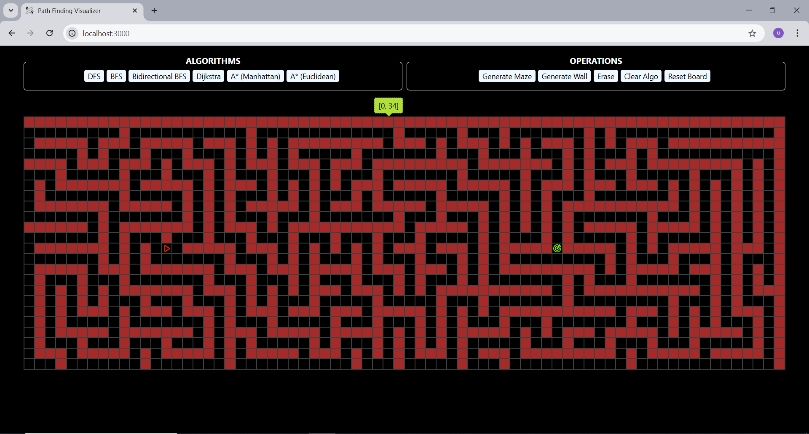

# Path Finding Visualizer

A **Path Finding Visualizer** built with **React** to help users understand path finding algorithms through interactive animations.

---

### Features
- Visualize popular algorithms: **Dijkstra**, **A\***, **BFS**, **DFS**
- Interactive grid: set **start**, **end**, and **walls**
- Clear and reset grid functionality

---

### Screenshot

---